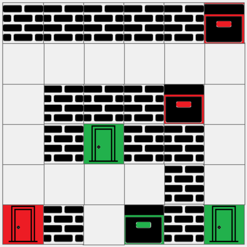
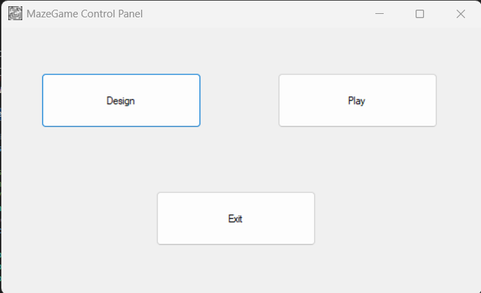
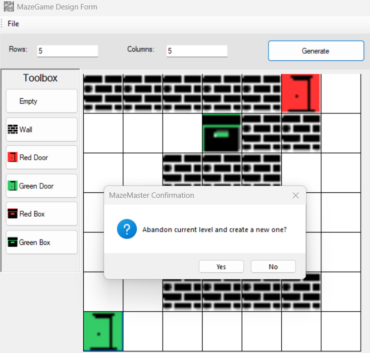
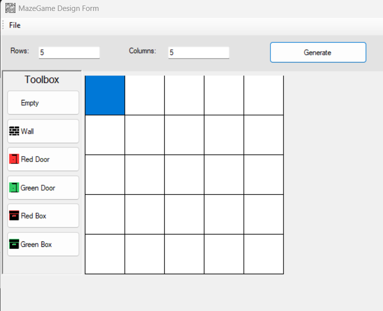
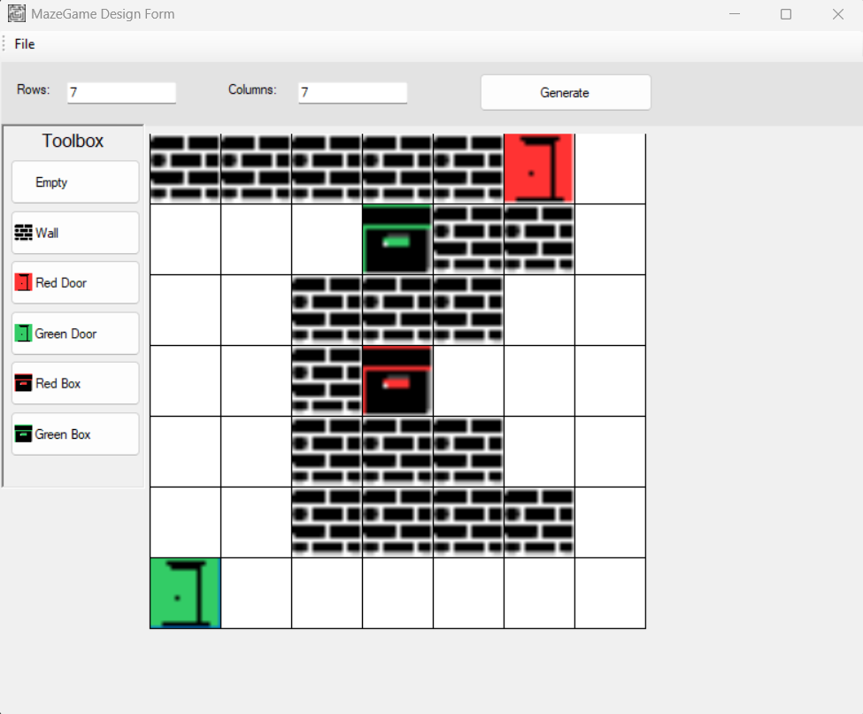
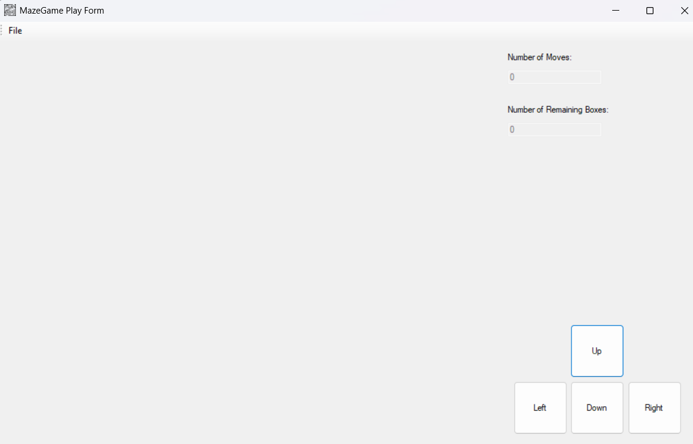
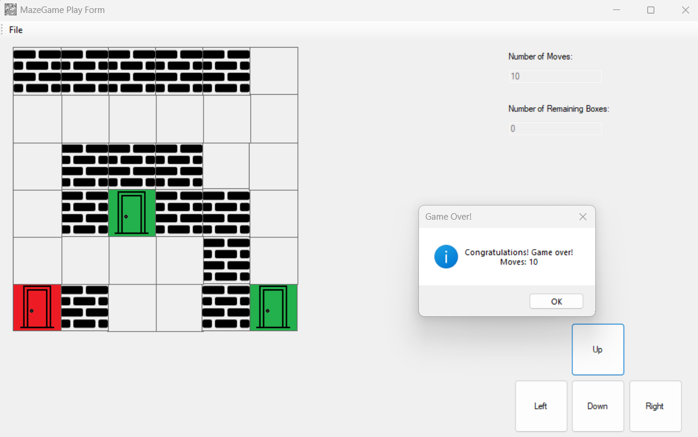
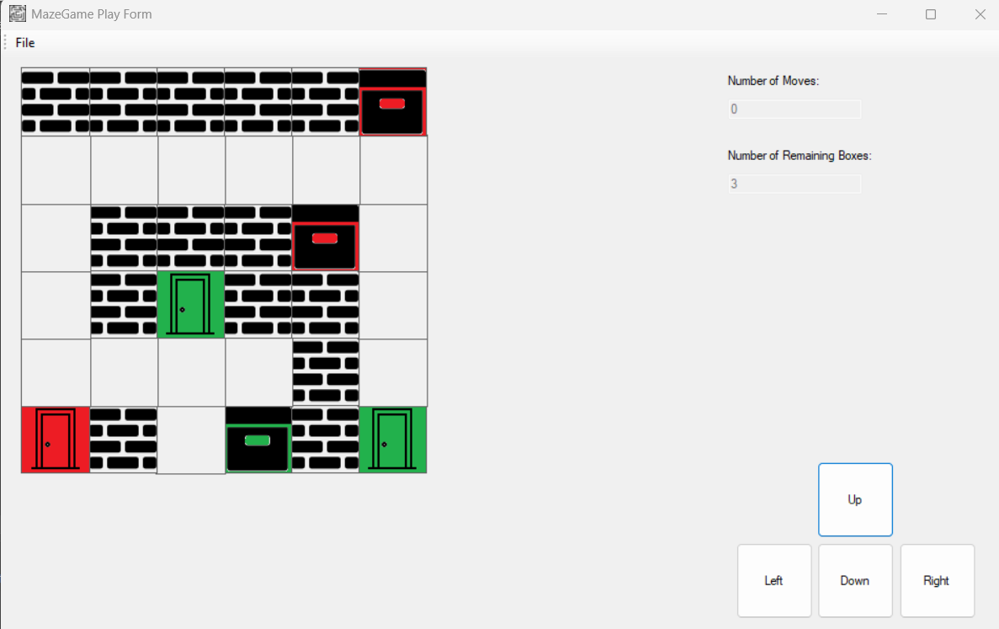

# MazeMaster

MazeMaster is a C# application designed to provide an engaging maze design and gameplay experience. Users can design custom mazes and play through them while tracking moves and solving the puzzle.



## Table of Contents

1. [Features](#features)
2. [Requirements](#requirements)
3. [Installation](#installation)
4. [Usage](#usage)
5. [Screenshots](#screenshots)
6. [Contributing](#contributing)
7. [License](#license)

## Features

- Control panel to navigate between designing and playing
- Maze design functionality with customizable rows and columns
- Ability to place walls, doors, and boxes in the maze
- Dynamic validation for creating or abandoning levels
- Maze gameplay with move tracking and game-winning conditions

## Requirements

- Windows OS
- .NET Framework 4.7.2 or higher
- Visual Studio 2017 or newer (recommended)

## Installation

1. Clone the repository:

   ```bash
   git clone https://github.com/liamc-code/MazeMaster.git
   ```

2. Open the solution file `MazeMaster.sln` in Visual Studio.

3. Build and run the application by pressing `F5` or selecting "Start Debugging" from the "Debug" menu.

4. Alternatively, download the latest release:

   - Visit the [Releases](https://github.com/liamc-code/MazeMaster/releases) page in the GitHub repository.
   - Download the `.exe` file from the latest release.
   - Run the `.exe` file to launch the application without needing Visual Studio.

## Usage

1. **Control Panel**:
   - Choose between designing a maze, playing a maze, or exiting the application.

2. **Maze Design**:
   - Set the number of rows and columns for the maze grid.
   - Use the toolbox to place walls, doors, and boxes in the grid.
   - Save or abandon the current level as needed.

3. **Maze Gameplay**:
   - Load a designed maze into the gameplay form.
   - Move through the maze using directional buttons.
   - Complete the maze by matching boxes to corresponding doors.

## Screenshots

### Control Panel


### Design Form with Abandon Level Confirmation


### Empty Design Form


### Filled Design Form


### Play Form - Empty View


### Play Form - Game Won


### Play Form - Loaded Level


## License

MazeMaster is released under the [MIT License](./LICENSE).
